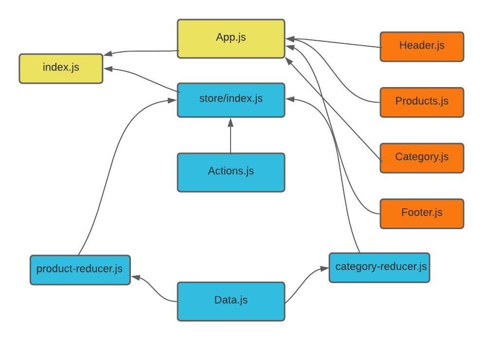
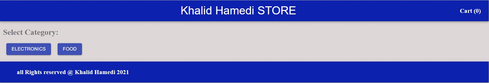
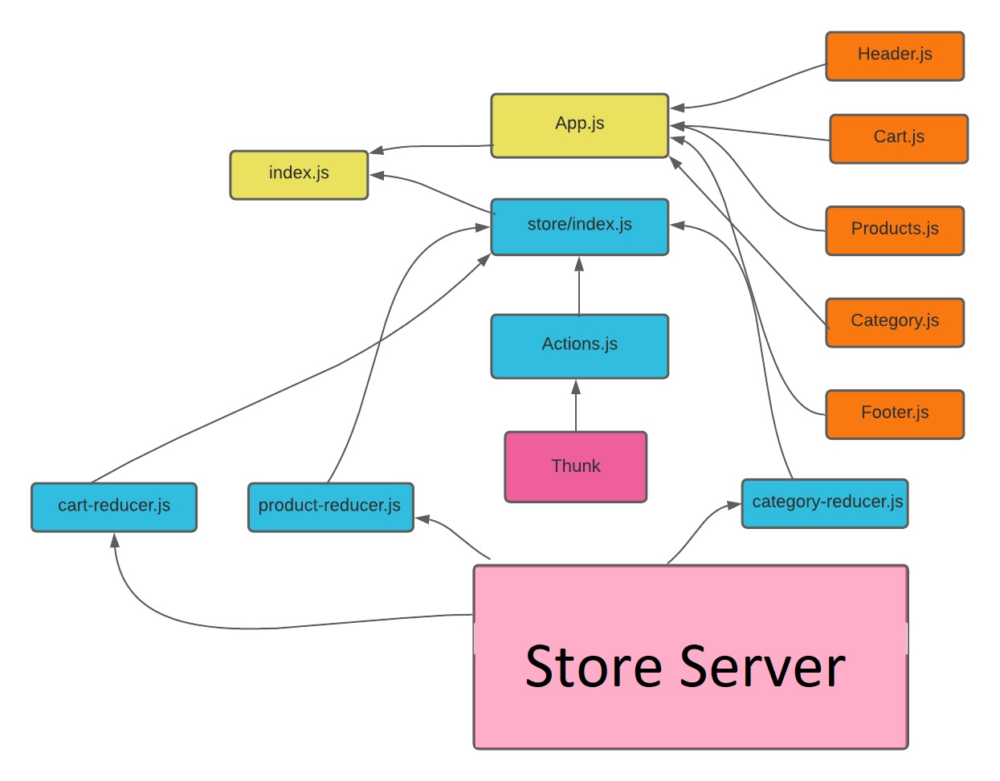

# storefront

## Author : Khalid Hamedi

## Description :

- ### an application that will power an online storefront that will allow our users to browse our product offerings by category, place items in their shopping cart, and check-out when they are ready to make their purchase

## LAB 36 - Application State with Redux

## store-front App Phase 1:

### In Phase 1, setup the basic scaffolding of the application with initial styling and basic behaviors. This initial build sets up the file structure and state management so that we can progressively build this application in a scalable manner

The following user/developer stories detail the major functionality for this phase of the project.

1.  As a user, I expect to see a list of available product categories in the store so that I can easily browse products

2.  As a user, I want to choose a category and see a list of all available products matching that category

3.  As a user, I want a clean, easy to use user interface so that I can shop the online store with confidence

**Links** : [**Netlify**](https://nervous-euclid-9c02fa.netlify.app/)

## UML :

## result /lab 36 :

---

## Asynchronous Actions

## store-front App Phase 3:

### Virtual Store Phase 3: Connect the Virtual Store to an API to retrieve live data from your data source, using thunk to enable asynchronous actions

In phase 3, we will be connecting our Virtual Store to a live API so that our data is persistent and able to be separately managed.

The user stories from Phases 1 and 2 remain unchanged. For this phase, we are now adding the following new user stories to meet the new requirements.

1. As a user, I want to interact with live inventory so that I have confidence that the displayed products are in stock
2. As a user, I want to know to that when I add an item to my cart, that it is removed from inventory so that no other users can purchase it

## Links and Resources:

[Netlify](https://61c2962c3d6bb6cbcd8e7c7d--hopeful-villani-4cbce6.netlify.app/)
[store-server-Heroku](https://khalidstore.herokuapp.com/)

- ### [store-server-repo](https://github.com/khalidsy90/-store-server)

## UML :

